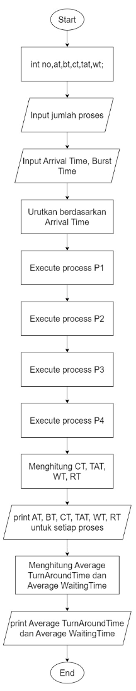
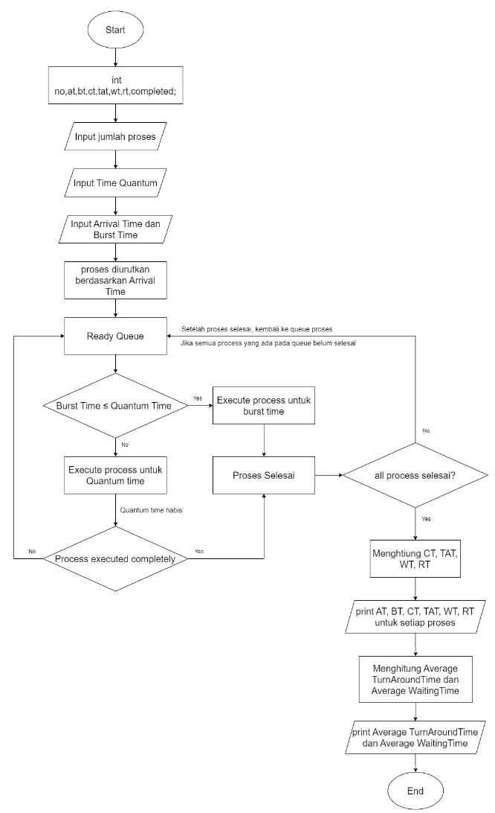
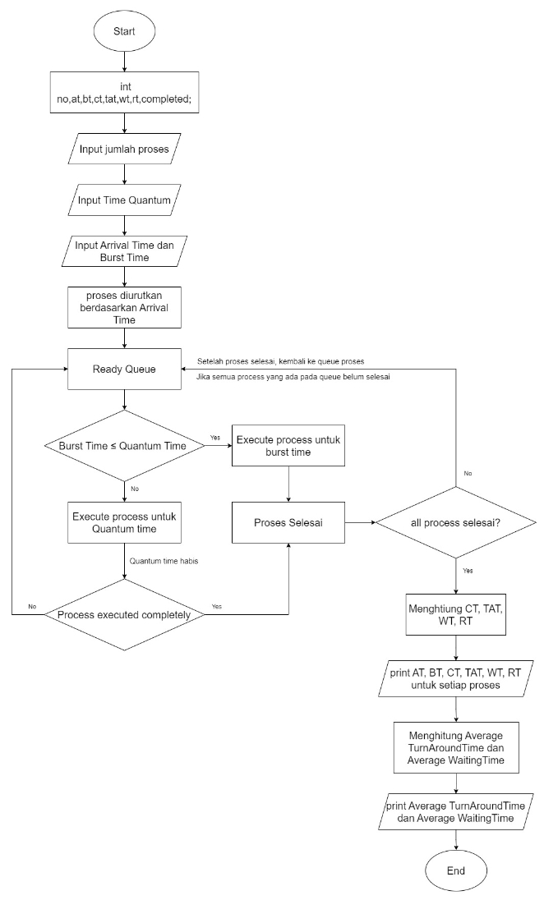

  <h1 style="text-align: center;font-weight: bold">Praktikum 11 Praktek Sistem Operasi</h1>
  <h4 style="text-align: center;">Dosen Pengampu : Dr. Ferry Astika Saputra, S.T., M.Sc.</h4>

 

  
  <h3 style="text-align: center;">Disusun Oleh : </h3>
  

    <strong>Adrian Yoga Chrisarianto (3123500021) </strong> 
  

<h3 style="text-align: center;line-height: 1.5">Politeknik Elektronika Negeri Surabaya Departemen Teknik Informatika Dan Komputer Program Studi Teknik Informatika 2023/2024</h3>
  

## Scheduling Algorithm

#### First-Come First-Serve Algorithm

##### Flowchart

##### Analisa 

Algoritma First-Come First-Serve telah berhasil sesuai dengan teori, seperti yang ditunjukkan oleh gambar hasil penelitian di atas. Algoritma ini bekerja berdasarkan prinsip antrian, yang berarti bahwa proses yang datang pertama (waktu kedatangan paling awal) dijalankan terlebih dahulu, kemudian proses berikutnya dijalankan setelah proses sebelumnya selesai, dan seterusnya. Dalam teori antrian, proses yang datang lebih awal dilayani terlebih dahulu, sehingga semua proses berjalan secara berurutan.

#### Round Robin Algorithm

##### Flowchart

##### Analisa 

Algoritma Round Robin menggunakan time quantum, yang pada dasarnya adalah batas waktu sebuah proses. Proses akan berjalan selama burst time jika burst timenya lebih kecil dari time quantum. Jika burst timenya lebih besar dari time quantum, proses tersebut akan berjalan selama time quantum tersebut. Setelah berjalan selama time quantum, burst time akan diperbarui menjadi sisa burst time. Setelah itu, proses tersebut akan dikembalikan ke queue siap hingga semua proses selesai. Output queue pada percobaan di atas menunjukkan urutan proses berjalan, dimulai dari P1 ke P2 ke P1 ke P3 ke P2 ke P1 kembali ke P1.

#### Shortest Job First Algorithm

##### Flowchart

##### Analisa 

Algoritma Shortest Job First memprioritaskan proses dengan burst time paling pendek sambil mempertimbangkan waktu kedatangan. Proses yang pertama datang akan dieksekusi sampai selesai terlebih dahulu, dan kemudian proses-proses yang ada di baris siap dibandingkan untuk menentukan mana yang memiliki burst time paling singkat dan mana yang akan dieksekusi selanjutnya. Jika ada beberapa proses dengan burst time yang sama, maka proses dengan burst time paling pendek akan dieksekusi pertama.