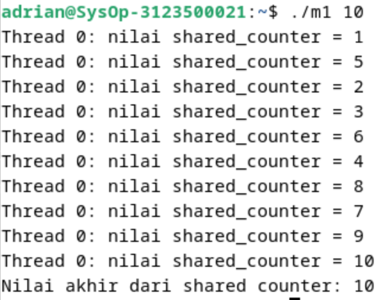
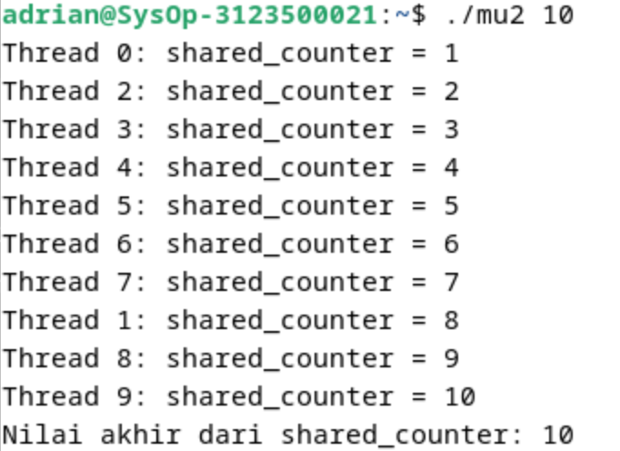

  <h1 style="text-align: center;font-weight: bold">Praktikum 11 Praktek Sistem Operasi</h1>
  <h4 style="text-align: center;">Dosen Pengampu : Dr. Ferry Astika Saputra, S.T., M.Sc.</h4>

 

  
  <h3 style="text-align: center;">Disusun Oleh : </h3>
  

    <strong>Adrian Yoga Chrisarianto (3123500021) </strong> 
  

<h3 style="text-align: center;line-height: 1.5">Politeknik Elektronika Negeri Surabaya Departemen Teknik Informatika Dan Komputer Program Studi Teknik Informatika 2023/2024</h3>
  

# Mutex (Analisa Soal 2)

## Program Tanpa Mutex

### Output

### Analisa

program pertama tidak menggunakan mutex
yang berakibat pada terjadinya race condition hyang mana thread bersaing untuk mengakses dan
memodifikasi nilai shared_counter secara bersamaan karena tidak ada sinkronisasi akses terhadap
variabel global shared_counter.

## Program Dengan Mutex

### Output 

### Analisa

program kedua menggunakan mutex untuk sinkronisasi akses ke variabel
shared_counter. penggunaan mutex pada program kedua memberikan pencegaan dari terjadinya race
condition dan memastikan bahwa operasi penambahan shared_counter dilakukan secara atomik, agar
menghasilkan hasil yang konsisten.

### Kesimpulan

Adanya mutex menyebabkan jika sebuah thread ingin mengakses shared_counter, Thread harus
mengunci mutex dahulu dengan menggunakan pthread_mutex_lock(). Setelah selesai, thread akan
melepaskan kunci mutex dengan pthread_mutex_unlock(). Dengan menggunakan mutex, hanya satu
thread yang dapat mengakses atau memodifikasi shared_counter pada satu waktu, sehingga
memastikan konsistensi nilai dan mencegah race conditio