<div align="center">
  <h1 style="text-align: center;font-weight: bold">Praktikum 6<br>SysOp Proses dan Manajemen Proses</h1>
  <h4 style="text-align: center;">Dosen Pengampu : Dr. Ferry Astika Saputra, S.T., M.Sc.</h4>
</div>
<br />
<div align="center">
  
  <h3 style="text-align: center;">Disusun Oleh : </h3>
  <p style="text-align: center;">
    <strong>Adrian Yoga Chrisarianto (3123500021)</strong>
  </p>
<h3 style="text-align: center;line-height: 1.5">Politeknik Elektronika Negeri Surabaya<br>Departemen Teknik Informatika Dan Komputer<br>Program Studi Teknik Informatika<br>2023/2024</h3>
  <hr><hr>
</div>

## Daftar Isi
1. [Dasar teori](#dasar-teori)
2. [Tugas](#tugas)
    - [Tugas Pendahuluan](#tugas-pendahuluan)
    - [Percobaan](#percobaan)
3. [Kesimpulan](#kesimpulan)

# Proses dan Manajemen Proses

### POKOK BAHASAN

    ✓ Proses pada Sistem Operasi Linux
    ✓ Manajemen Proses pada Sistem Operasi Linux

### TUJUAN BELAJAR

Setelah mempelajari materi dalam bab ini, mahasiswa diharapkan mampu:

    ✓ Memahami konsep proses pada sistem operasi Linux.
    ✓ Menampilkan beberapa cara menampilkan hubungan proses parent dan child.
    ✓ Menampilkan status proses dengan beberapa format berbeda.
    ✓ Melakukan pengontrolan proses pada shell.
    ✓ Memahami penjadwalan prioritas.

## DASAR TEORI

#### 1. KONSEP PROSES PADA SISTEM OPERASI LINUX

Proses adalah program yang sedang dieksekusi. Setiap kali menggunakan utilitas sistem atau program aplikasi dari shell, satu atau lebih proses ”child” akan dibuat oleh shell sesuai perintah yang diberikan. Setiap kali instruksi dibe rikan pada Linux shell, maka kernel akan menciptakan sebuah proses-id. Proses ini disebut juga dengan terminology Unix sebagai sebuah Job. Proses Id (PID) dimulai dari 0, yaitu proses INIT, kemudian diikuti oleh proses berikutnya (terdaftar pada /etc/inittab).
Beberapa tipe proses :

- Foreground
    - Proses yang diciptakan oleh pemakai langsung pada terminal (interaktif, dialog)
- Batch
    - Proses yang dikumpulkan dan dijalankan secara sekuensial (sa  u persatu). Prose Batch tidak diasosiasikan (berinteraksi) dengan terminal.
- Daemon
    - Proses yang menunggu permintaan (request) dari proses lainnya dan menjalankan tugas sesuai dengan permintaan tersebut. Bila tidak ada request, maka program ini akan berada dalam kondisi “idle” dan tidak menggunakan waktu hitung CPU. Umumnya nama proses daemon di UNIX berakhiran d, misalnya inetd, named, popd dll

#### 2. SINYAL

Proses dapat mengirim dan menerima sinyal dari dan ke proses lainnya. Proses mengirim sinyal melalui instruksi “kill” dengan format.

    kill [-nomor sinyal] PID

Nomor sinyal : 1 s/d maksimum nomor sinyal yang didefinisikan system Standar nomor sinyal yang terpenting adalah :

| No Sinyal | Nama    | Deskripsi                                                                             |
| --------- | ------- | ------------------------------------------------------------------------------------- |
| 1         | SIGHUP  | Hangup, sinyal dikirim bila proses terputus, misalnya melalui putusnya hubungan modem |
| 2         | SIGINT  | Sinyal interrupt, melalui ^C                                                          |
| 3         | SIGQUIT | Sinyal Quit, melalui ^\                                                          |                                                                           |
| 9         | SIGKILL | Sinyal Kill, menghentikan proses                                                      |
| 15        | SIGTERM | Sinyal terminasi software                                                    |

#### 3. MENGIRIM SINYAL

Mengirim sinyal adalah satu alat komunikasi antar proses yaitu memberitahukan proses yang sedang berjalan bahwa ada sesuatu yang harus dikendalikan. Berdasarkan sinyal yang dikirim ini maka proses dapat bereaksi dan administrator/programmer dapat menentukan reaksi tersebut. Mengirim sinyal menggunakan instruksi

    kill [-nomor sinyal] PID

Sebelum mengirim sinyal PID proses yang akan dikirim harus diketahui terlebih dahulu.

#### 4. MENGONTROL PROSES PADA SHELL

Shell menyediakan fasilitas job control yang memungkinkan mengontrol beberapa job atau proses yang sedang berjalan pada waktu yang sama. Misalnya bila melakukan pengeditan file teks dan ingin melakukan interrupt pengeditan untuk mengerjakan hal lainnya. Bila selesai, dapat kembali (switch) ke editor dan melakukan pengeditan file teks kembali.</br>
Job bekerja pada <strong>foreground</strong> atau <strong>background</strong>. Pada foreground hanya diper untukkan untuk satu job pada satu waktu. Job pada foreground akan mengontrol shell - menerima input dari keyboard dan mengirim output ke layar. Job pada background tidak menerima input dari terminal, biasanya berjalan tanpa memerlukan interaksi</br>
Job pada foreground kemungkinan dihentikan sementara (suspend), dengan menekan [Ctrl-Z]. Job yang dihentikan sementara dapat dijalankan kembali pada foreground atau background sesuai keperluan dengan menekan <strong>”fg”</strong> atau <strong>”bg”</strong>. Sebagai catatan, menghentikan job seme ntara sangat berbeda dengan melakuakan interrupt job (biasanya menggunakan [Ctrl-C]), dimana job yang diinterrup akan dimatikan secara permanen dan tidak dapat dijalankan lagi.

#### 5. MENGONTROL PROSES LAIN

Perintah ps dapat digunakan untuk menunjukkan semua proses yang sedang berjalan pada mesin (bukan hanya proses pada shell saat ini) dengan format :

    ps –fae atau
    ps -aux

Beberapa versi UNIX mempunyai utilitas sistem yang disebut top yang menyediakan cara interaktif untuk memonitor aktifitas sistem. Statistik secara detail dengan proses yang berjalan ditampilkan dan secara terus-menerus di-refresh . Proses ditampilkan secara terurut dari utilitas CPU. Kunci yang berguna pada top adalah

    s – set update frequency
    u – display proses dari satu user
    k – kill proses (dengan PID)
    q – quit

Utilitas untuk melakukan pengontrolan proses dapat ditemukan pada sistem UNIX adalah perintah killall. Perintah ini akan menghentikan proses sesuai PID atau job number proses.

## Percobaan 5 (Menghentikan dan Memulai Kembali Job)
1. Cara lain meletakkan job pada background dengan memulai job secara normal (pada foreground), __stop__ job dan memulai lagi pada background
    ```
    $ yes > /dev/null
    ```
    
    Hentikan sementara job (suspend ), bukan menghentikannya (terminate ), tetapi menghentikan sementara job sampai di restart. Untuk menghentikan sementara job gunakan _Ctrl-Z_.

2. Untuk restart job pada _foreground_, gunakan perintah fg
    ```
    $ fg
    ```
    

3. Shell akan menampilkan nama perintah yang diletakkan di _foreground_ . Stop
job lagi dengan __Ctrl-Z__. Kemudian gunakan perintah `bg` untuk meletakkan job pada _background_ .
    ```
    $ bg
    ```
    
    Job tidak bisa dihentikan dengan __Ctrl-Z__ karena job berada pada _background_.
    Untuk menghentikannya, letakkan job pada _foreground_ dengan `fg` dan kemudian hentikan sementara dengan __Ctrl-Z__.
    ```
    $ fg
    ```
    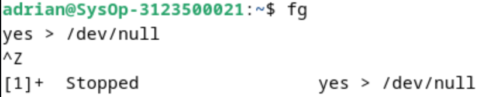

4. Job pada background dapat digunakan untuk menampilkan teks pada terminal, dimana dapat diabaikan jika mencoba mengerjakan job lain.
```
$ yes &
```
Untuk menghentikannya tidak dapat menggunakan Ctrl-C. Job harus dipindah ke foreground, baru dihentikan dengan cara tekan fg dan tekan Enter, kemudian dilanjutkan dengan Ctrl-Z untuk menghentikan sementara.

5.	Apabila ingin menjalankan banyak job dalam satu waktu, letakkan job pada
foreground atau background dengan memberikan job ID
```                             
$ fg %2          
$ bg %2
atau
$ %2
```
6.	tekan fg dan tekan Enter, kemudian dilanjutkan dengan Ctrl -Z untuk menghentikan sementara.

7.	Lihat job dengan perintah ps -fae dan tekan Enter. Kemudian hentikan proses dengan perintah kill.
$ ps -fae
$ kill -9 <NomorPID>

8.	Logout dan tekan Alt+F7 untuk kembali ke mode grafis

## Percobaan 6 : Percobaan dengan Penjadwalan Prioritas

1.	Login sebagai root.
2.	Buka 3 terminal, tampilkan pada screen yang sama.

 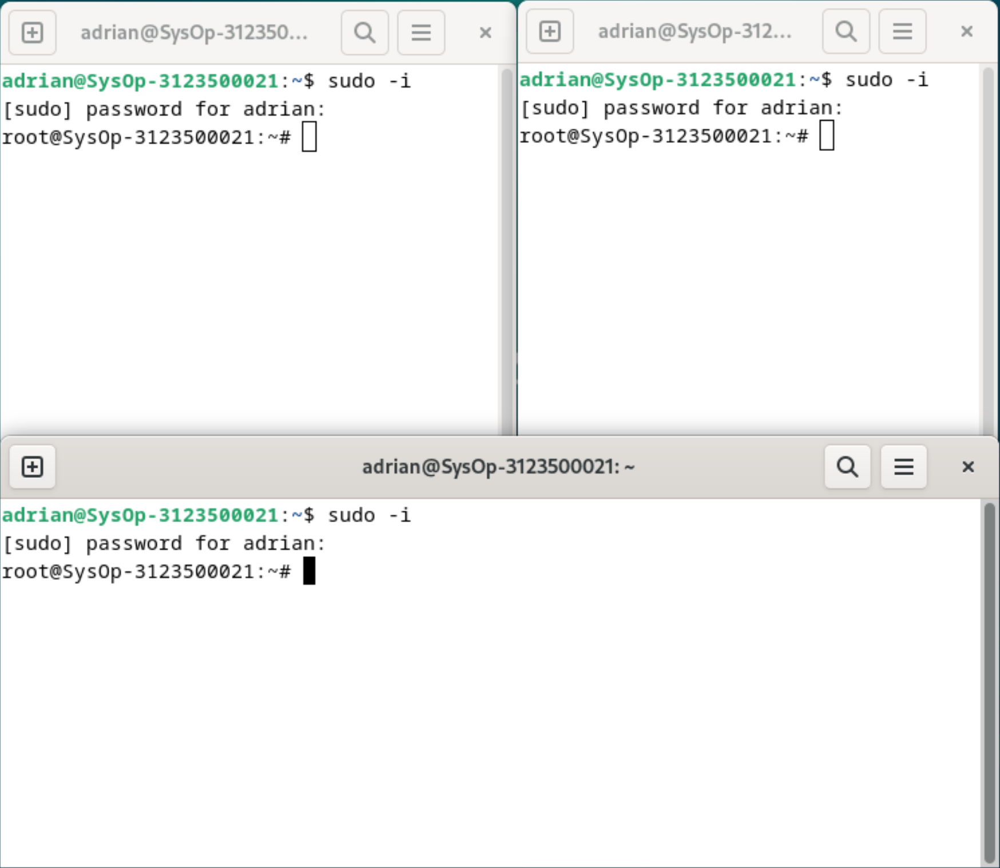

3.	Pada setiap terminal, ketik PS1 = ” \w:” diikuti Enter. \w menampilkan path pada direktori home.


4.	Karena login sebagai root, maka akan ditampilkan ~: pada setiap terminal. Untuk setiap terminal ketik pwd dan tekan Enter untuk melihat bahwa Anda sedang berada pada direktori /root.


5.	Buka terminal lagi (keempat), atur posisi sehingga keempat terminal terlihat
pada screen.


6.	Pada terminal keempat, ketik top dan tekan Enter. Maka program top akan muncul. Ketik i. Top akan menampilkan proses yang aktif. Ketik lmt. Top tidak lagi menampilkan informasi pada bagian atas dari screen. Pada percobaan ini, terminal ke empat sebagai je ndela Top.

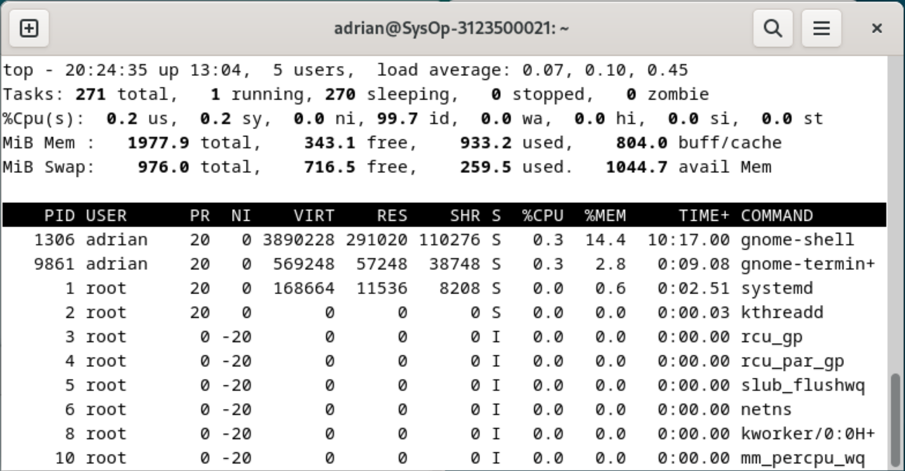
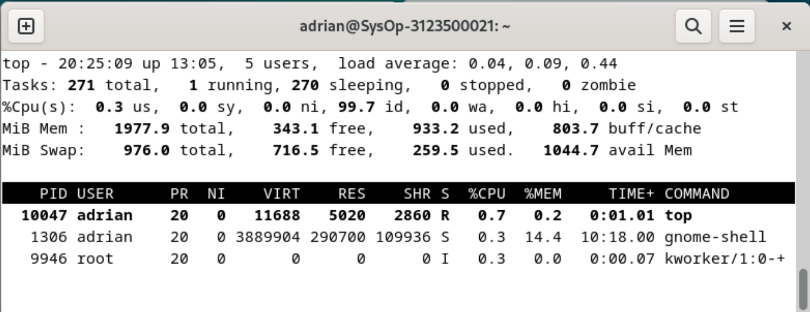
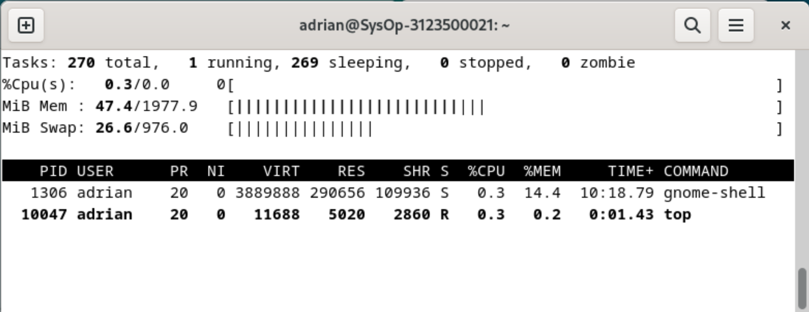

7.	Pada terminal 1, bukalah program executable C++ dengan mengetik program
yes dan tekan Enter.

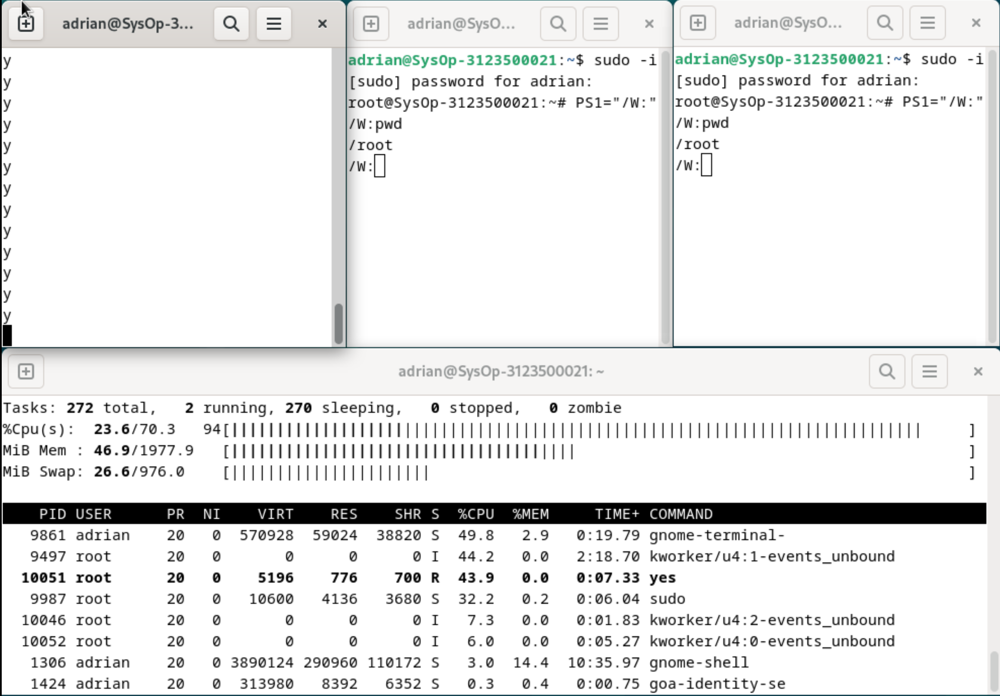

8.	Ulangi langkah 7 untuk terminal 2.

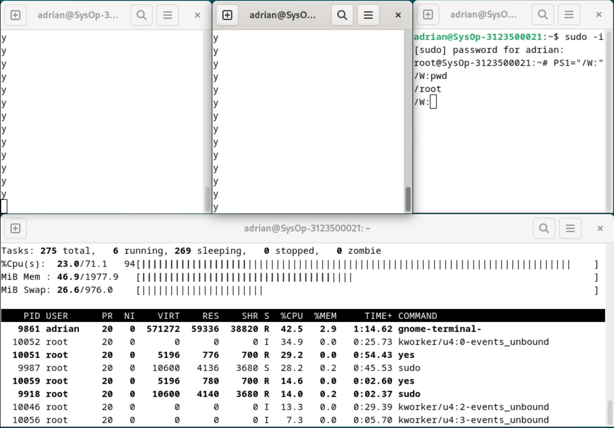

9.	Jendela Top akan menampilkan dua program yes sebagai proses yang berjalan. Nilai %CPU sama pada keduanya. Hal ini berarti kedua proses mengkonsumsi waktu proses yang sama dan berjalan sama cepat. PID dari kedua proses akan berbeda, misalnya 3148 dan 3149. Kemudian gunakan terminal 3 (yang tidak menjalankan primes maupun Jendela Top) dan ketik renice 19 <PID terimnal 1> (contoh : renice 19 3148) dan diikuti Enter. Hal ini berarti mengganti penjadwalan prioritas dari proses ke 19.

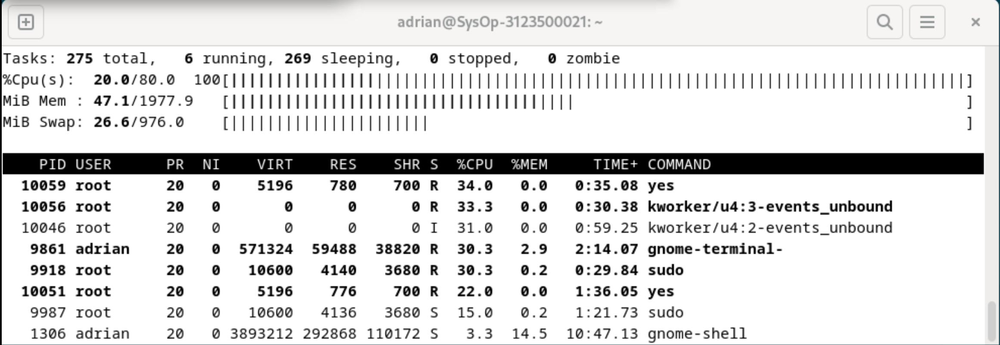

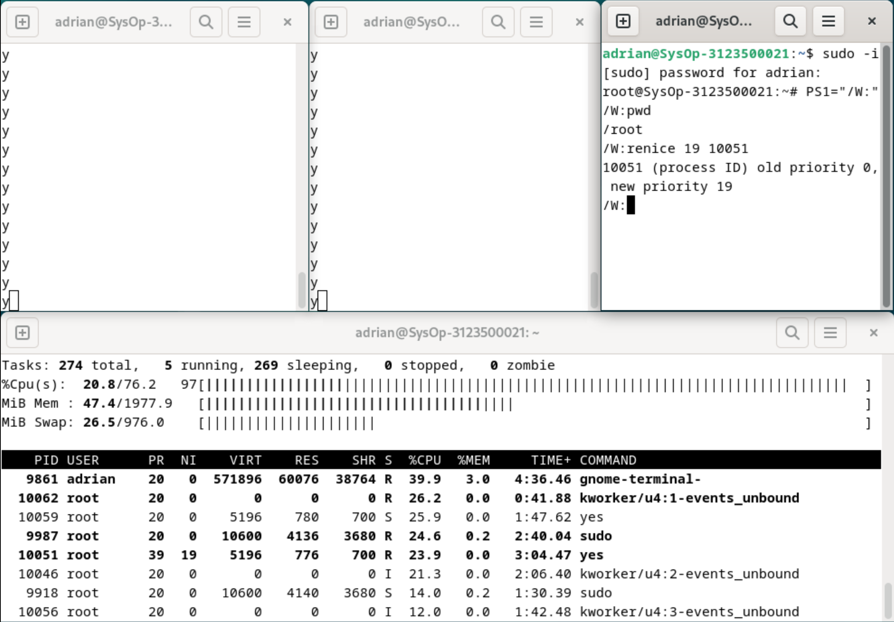

10.	Tunggu beberapa saat sampai program top berubah dan terlihat pada jendela
Top. Pada kolom STAT memperlihatkan N untuk proses 3148. Hal ini berarti bahwa penjadwalan prioritas untuk proses 3148 lebih besar (lebih lambat) dari 0. Proses 3149 berjalan lebih cepat.

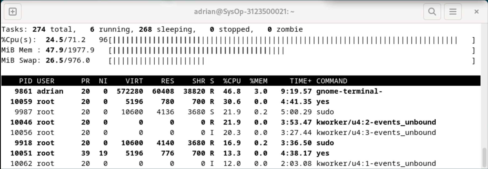

11.	Program top juga mempunyai fungsi yang sama dengan program renice. Pilih Jendela Top dan tekan r. Program top terdapat prompt PID to renice: tekan 3148 (ingat bahwa Anda harus mengganti 3148 dengan PID
Anda sendiri) dan tekan Enter. Program top memberikan prompt Renice PID 3148 to value: tekan -19 dan tekan Enter.


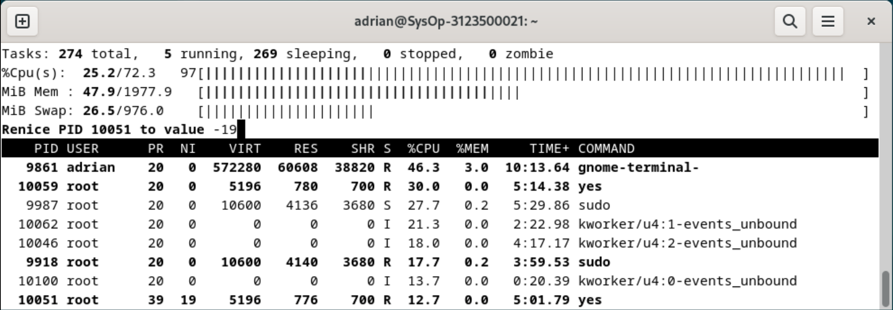

12.	Tunggu beberapa saat sampai top berubah dan lihat nilai %CPU pada kedua proses. Sekarang proses 3148 lebih cepat dari proses 3149. Kolom status menunjukkan < pada proses 3148 yang menunjukkan penjadwalan
prioritas lebih rendah (lebih cepat) dari nilai 0.

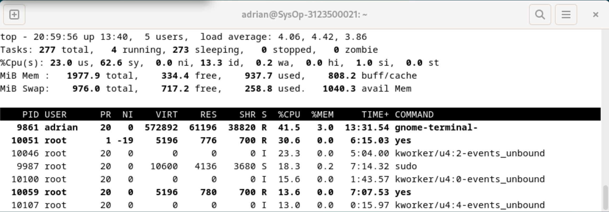

13.	Pilih terminal 3 (yang sedang tidak menjalankan yes atau program top) dan ketik nice –n -10 yes dan tekan Enter. Tunggu beberapa saat agar
program top berubah dan akan terlihat proses primes ketiga. Misalnya PID nya 4107. Opsi -10 berada pada kolom NI (penjadwalan prioritas).

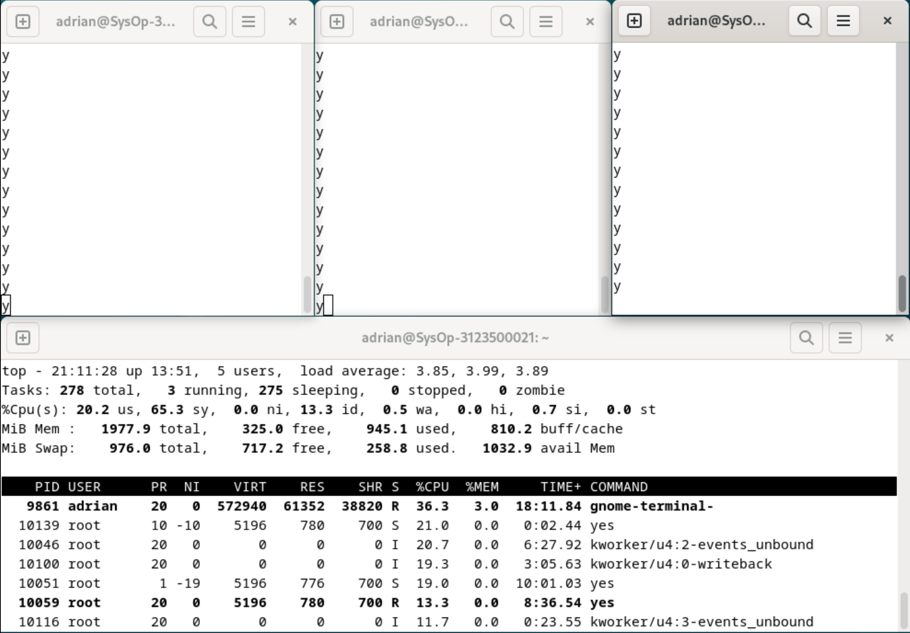

14.	Jangan menggunakan mouse dan keyboard selama 10 detik. Program top menampilkan proses yang aktif selain program yes. Maka akan terlihat proses top terdaftar tetapi %CPU kecil (dibawah 1.0) dan konsisten. Juga terlihat proses berhubungan dengan dekstop grafis seperti X, panel dll.

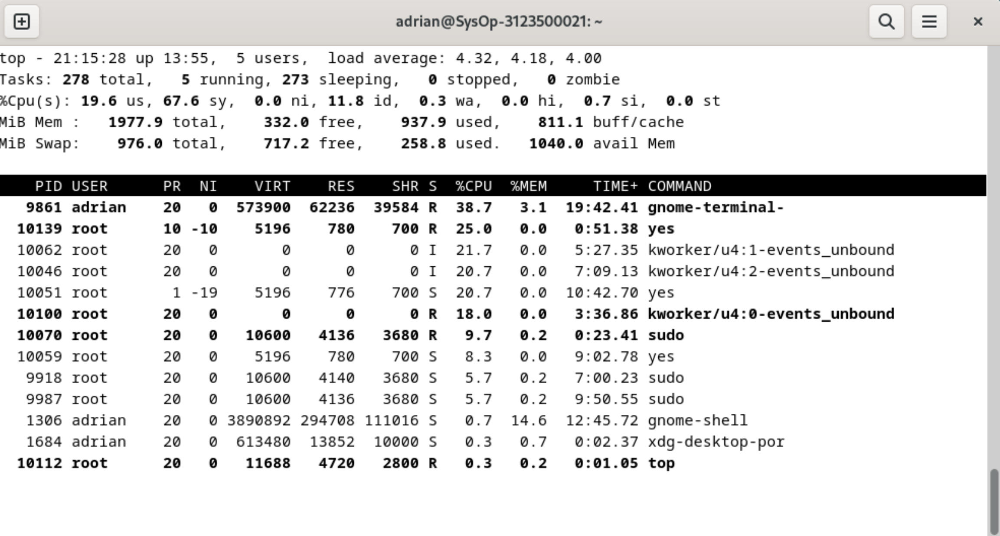

15.	Pindahkan mouse sehingga kursor berubah pada screen dan lihat apa yang
terjadi dengan tampilan top.  Proses tambahan akan muncul dan nilai
%CPU berubah sebagai bagian grafis yang bekerja. Satu alasan adalah bahwa proses 4107 berjalan pada penjadwalan prioritas tinggi. Pilih jendela Top, ketik r. PID to renice : muncul prompt. Ketik 4107 (ubahlah 4107 dengan PID Anda) dan tekan Enter. Renice PID 4107 to value: muncul prompt. Ketik 0 dan tekan Enter. Sekarang pindahkan mouse ke sekeliling screen. Lihat perubahannya.

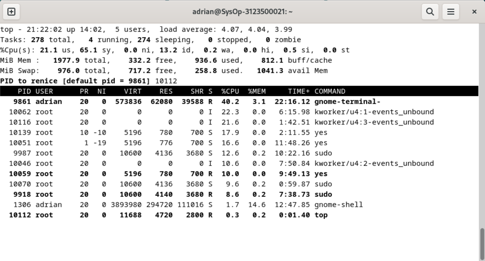
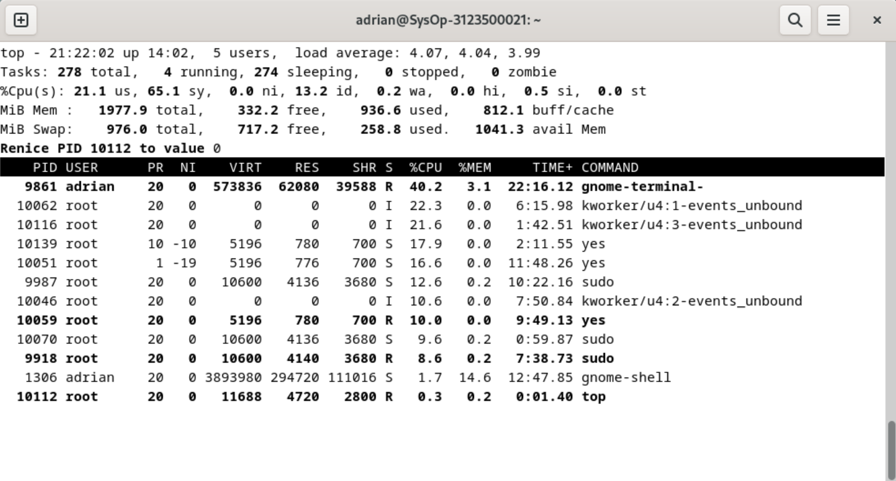
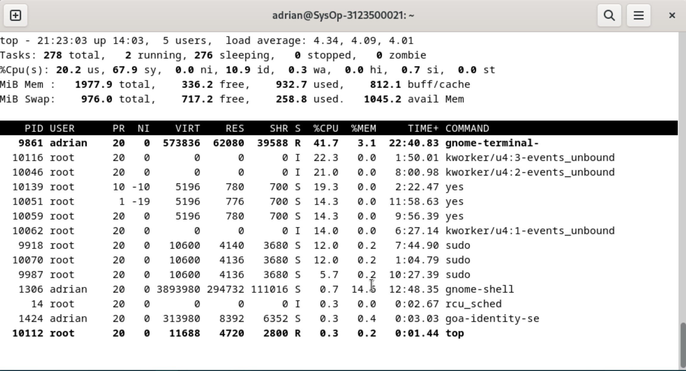

16.	Tutup semua terminal window.
17.	Logout dan login kembali sebagai user.

## LATIHAN:

1.	Masuk ke tty2 dengan Ctrl+Alt+F2. Ketik ps – au dan tekan Enter. Kemudian perhatikan keluaran sebagai berikut :
a.	Sebutkan nama -nama proses yang bukan root
b.	Tulis PID dan COMMAND dari proses yang paling banyak menggunakan CPU time
c.	Sebutkan buyut proses dan PID dari proses tersebut
d.	Sebutkan beberapa proses daemon
e.	Pada prompt login lakukan hal- hal sebagai berikut :
$ csh
$ who
$ bash
$ ls
$ sh
$ ps
f.	Sebutkan PID yang paling besar dan kemudian buat urut-urutan proses sampai ke PPID = 1.
2.	Cobalah format tampilan ps dengan opsi berikut dan perhatikan hasil tampilannya :
•	-f	daftar penuh
•	-j	format job
•	j	format job control
•	l	daftar memanjang
•	s	format sinyal
•	v	format virtual memory
•	X	format register i386
2.	Lakukan urutan pekerjaan berikut :
a.	Gunakan perintah find ke seluruh direktory pada sistem, belokkan output sehingga daftar direktori dialihkan ke file directories.txt dan daftar pesan error dialihkan ke file errors.txt
b.	Gunakan perintah sleep 5. Apa yang terjadi dengan perintah ini ?
c.	Jalankan perintah pada background menggunakan &
d.	Jalankan sleep 15 pada foreground , hentikan sementara dengan Ctrl- Z dan kemudian letakkan pada background dengan bg. Ketikkan jobs. Ketikkan ps. Kembalikan job ke foreground dengan perintahfg.
e.	Jalankan sleep 15 pada background menggunakan & dan kemudian gunakan perintah kill untuk menghentikan proses diikuti job number.
f.	Jalankan sleep 15 pada background menggunakan & dan kemudian gunakan kill untuk menghentikan sementara proses. Gunakan bg untuk melanjutkan menjalankan proses.
g.	Jalankan sleep 60 pada background 5 kali dan terminasi semua pada dengan menggunakan perintah killall.
h.	Gunakan perintah ps, w dan top untuk menunjukkan semua proses yang sedang dieksekusi.


## Kesimpulan
Proses dan manajemen proses memainkan peran kunci dalam operasi sistem Linux, mengatur dan mengelola eksekusi program serta penggunaan sumber daya sistem. Konsep proses dalam sistem operasi Linux mencakup pengelompokan program yang sedang berjalan ke dalam unit-unit yang dapat dikelola, dengan masing-masing memiliki identitas unik yang disebut PID (Process ID). Ini memungkinkan sistem untuk melacak dan mengontrol proses secara efisien.

Salah satu aspek penting dari manajemen proses adalah pengiriman sinyal. Sinyal adalah pesan yang dikirim oleh sistem operasi atau proses lain ke proses untuk memberikan notifikasi atau meminta tindakan tertentu. Dalam lingkungan Linux, sinyal ini dapat digunakan untuk berbagai tujuan, termasuk menghentikan, menghentikan, atau merestart proses. Perintah kill digunakan untuk mengirim sinyal ke proses dengan format kill [-nomor sinyal] PID.

Pengguna juga dapat mengontrol proses pada shell menggunakan berbagai perintah. Perintah ps adalah salah satu alat yang paling umum digunakan untuk menampilkan informasi tentang proses yang sedang berjalan pada sistem. Misalnya, dengan ps -u, pengguna dapat melihat proses yang berhubungan dengan pengguna tertentu, sedangkan ps -a dan ps -e dapat digunakan untuk menemukan proses lain atau menampilkan semua proses yang sedang berjalan pada sistem. Perintah pstree memberikan informasi serupa seperti ps, tetapi dalam format pohon yang lebih mudah dipahami.

Manajemen proses juga melibatkan kontrol atas prioritas eksekusi. Perintah nice dan renice memungkinkan pengguna untuk mengubah prioritas proses, memberi mereka lebih sedikit atau lebih banyak sumber daya sistem relatif terhadap proses lain. Ini penting untuk mengoptimalkan kinerja sistem, memastikan bahwa proses-proses kritis mendapatkan prioritas yang tepat sesuai dengan kebutuhan mereka.

Selain itu, dalam konteks manajemen proses, kita juga memahami perbedaan antara proses yang berjalan di latar belakang (background) dan proses yang berjalan di latar depan (foreground). Proses latar depan menerima input dari keyboard dan mengirim output ke layar, sementara proses latar belakang biasanya berjalan tanpa memerlukan interaksi langsung dengan pengguna.

Keseluruhan, pemahaman tentang konsep proses, pengiriman sinyal, penggunaan perintah untuk mengontrol proses pada shell, serta pemahaman tentang perbedaan antara proses latar depan dan latar belakang adalah kunci dalam manajemen efektif dari eksekusi program dan penggunaan sumber daya sistem pada sistem operasi Linux.