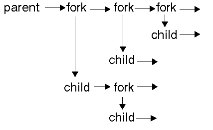
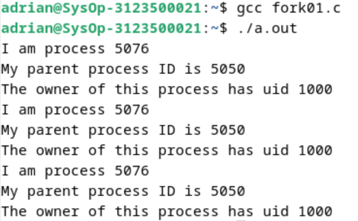
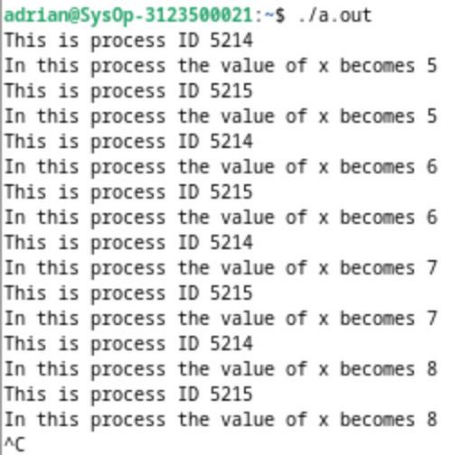
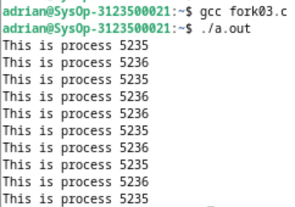
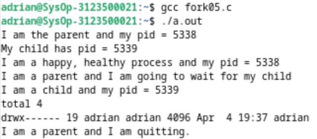
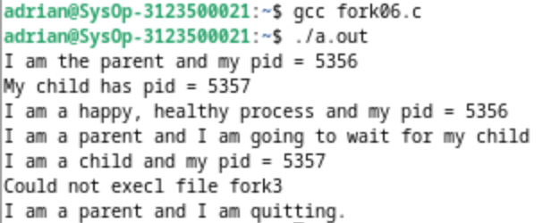
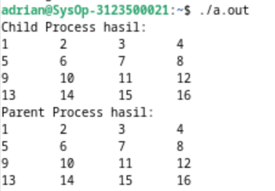

<div align="center">
  <h1 style="text-align: center;font-weight: bold">Praktikum 6<br>Proses Fork Multithread</h1>
  <h4 style="text-align: center;">Dosen Pengampu : Dr. Ferry Astika Saputra, S.T., M.Sc.</h4>
</div>
<br />
<div align="center">
  
  <h3 style="text-align: center;">Disusun Oleh : </h3>
  <p style="text-align: center;">
    <strong>Adrian Yoga Chrisarianto (3123500021)</strong>
  </p>
<h3 style="text-align: center;line-height: 1.5">Politeknik Elektronika Negeri Surabaya<br>Departemen Teknik Informatika Dan Komputer<br>Program Studi Teknik Informatika<br>2023/2024</h3>
  <hr><hr>
</div>

## Daftar Isi
1. [Dasar teori](#dasar-teori)
2. [Tugas](#tugas)
    - [Tugas Percobaan 5](#percobaan-5-menghentikan-dan-memulai-kembali-job)
    - [Tugas Percobaan 6](#percobaan-6-percobaan-dengan-penjadwalan-prioritas)
    - [Tugas Latihan](#latihan)
3. [Kesimpulan](#kesimpulan)

# Process - Fork - Multithread
Setiap program atau bagian dari program yang sedang dieksekusi oleh CPU disebut dengan proses. Proses dapat berjalan secara _foreground_ atau _background_. 

Untuk melihat seluruh proses yang sedang berjalan gunakan perintah `$ ps -e` .
Bisa juga menggunakan perintah `$pstree | more` untuk melihat secara detil proses yang sefan berjalan dengan format **tree**.

Setiap proses akan memilik **PID**  Process ID). Apabila dibutuhkan Sebuah proses bisa memiliki proses anakan. Dalam hubungan tersebut proses dapat diibaratkan seperti orang tua (_parent_) dengan anak (_child_) yang turun temurun.
- Setiap proses memiliki parent dan child.
- Setiap proses memiliki ID (_pid_) dan parent ID (_ppid_), kecuali proses `init` atau `systemd`.
- _ppid_ dari sebuah proses adalah ID dari parent proses tersebut. 

```mermaid
classDiagram
      Parent_Process --|> Child_Process
      Parent_Process : PID =4900
      Parent_Process : PPID = 4
      Parent_Process: bash
      class Child_Process{
          PID=4901
          PPID = 4900
          fork01
      }
   ```

   Perhatikan, ppid dari proses `fork01` adalah pid dari proses `bash`.

**fork** digunakan untuk menduplikasi proses. Proses yang baru disebut dengan child proses, sedangkan proses pemanggil disebut dengan parent proses. Spesifikasi fork bisa dilihat dengan `$ man 2 fork`. 
```
int main() { 
                            pid: 2308, ppid: 10 
                             [Main process]
                                 |
  fork();              > Child process created <
                                 +
                               /   \
                             /       \
               pid: 2308, ppid: 10    pid: 30, ppid: 2308
                [Parent Process]    [Child Process]

  return 0;
}
```
perhatikan bahwa :
- `pid` Parent Process == `ppid` Child
- `child_id` Parent Process == `pid` Child Process

**Exec** adalah function yang digunakan untuk menjalankan program baru dan mengganti program yang sedang berlangsung. `exec` adalah program family yang memiliki berbagai fungsi variasi, yaitu `execvp`, `execlp`, `execv`, dan lain lain.

**wait** adalah function yang digunakan untuk mendapatkan informasi ketika child proses berganti _state_-nya. Pergantian state dapat berupa _termination_, _resume_, atau _stop_.

Manual: `$ man 3 exec`

## 1. Fork : Parent - Child Process
- Buat tulisan tentang konsep **fork**  dan implementasinya dengan menggunakan bahasa pemrograman C! (minimal 2 paragraf disertai dengan gambar)

**JAWAB**

### Konsep `fork` dalam Bahasa Pemrograman C


Dalam bahasa pemrograman C, `fork()` adalah sebuah _sistem panggilan_ `sistem panggilan` yang digunakan untuk membuat _proses anak_ _(proses anak)_ dari _proses induk_ _(proses induk). Dengan kata lain, `fork()` membuat duplikat dari proses panggilan sehingga kedua proses, proses induk dan proses anak, memiliki konteks memori yang berbeda dan dapat berjalan secara mandiri setelah pemantapan.
### Implementasi `fork()` dalam Bahasa Pemrograman C
[Implementasi fork() bahasa c](fork.c)

Dalam contoh di atas:

- `fork()` digunakan untuk membuat proses baru. Setelah pemanggilan `fork()`, dua proses akan berjalan secara paralel.
- Jika nilai yang dikembalikan oleh `fork()` adalah 0, itu berarti proses tersebut adalah proses anak _(Child Process)_.
- Jika nilai yang dikembalikan oleh `fork()` lebih besar dari 0, itu berarti proses tersebut adalah proses induk _(Parent Process)_. Nilai yang dikembalikan adalah __PID__ dari proses anak _(Child Process)_.
- Jika terjadi kesalahan saat memanggil `fork()`, nilai yang dikembalikan akan kurang dari 0, dan pesan kesalahan akan dicetak.

Dengan menggunakan `fork()`, program dapat membuat proses baru untuk menjalankan tugas-tugas tertentu secara paralel, meningkatkan kinerja dan efisiensi program.

- Akses dan clonning repo : https://github.com/ferryastika/operatingsystem.git

- Deskripsikan dan visualisasikan pohon proses hasil eksekusi dari kode program `fork01.c`, `fork02.c`, `fork03.c`, `fork04.c`, `fork05.c`dan `fork06.c`.

**JAWAB**

- **fork01.c**
```
#include <stdio.h>
#include <unistd.h>

int main(void) {
  pid_t mypid;
  uid_t myuid;
  for (int i = 0; i < 3; i++) {
    mypid = getpid();
    printf("I am process %d\n", mypid);
    printf("My parent process ID is %d\n", getppid());
    printf("The owner of this process has uid %d\n", getuid());
    /* sleep adalah system call atau fungsi library
    yang menghentikan proses ini dalam detik
    */
    sleep(3);
  }
  return 0;
}
```


- Parent Process dibuat (PID).
- Parent Process mencetak informasi proses (PID, PPID, UID) 3 kali dengan sleep (delay) 3 detik di antara setiap iterasi.
```

        PID_A (cetak PID, PPID, UID)  (Parent Process)
         |
         v (loop 3x dan jeda 3 detik)
  Cetak PID, PPID, UID

```
- **fork02.c**
```
#include <stdio.h>
#include <unistd.h>

int main(void) {
  pid_t childpid;
  int x = 5;
  childpid = fork();

  while (1) {
    printf("This is process ID %d\n", getpid());
    printf("In this process the value of x becomes %d\n", x);
    sleep(2);
    x++;
  }
  return 0;
}
```

**loop tidak berujung ctrl+c untuk menghentikan proses*

- Parent Process membuat Child Process.
- Kedua proses (Parent dan Child) terus mencetak PID dan nilai variabel x yang diubah di dalam loop tak hingga (perilaku tidak disarankan).
- Pohon Proses (tidak stabil karena Infinite loop):
```
  PID_A  (Parent Process)   
    |
    v (fork) jeda 2 detik
  PID_B (Child Process)

(Infinite loop)
```

- **fork03.c**
```
#include <stdio.h>
#include <unistd.h>

int main(void) {
  pid_t childpid;
  childpid = fork();

  for (int i = 0; i < 5; i++) {
    printf("This is process %d\n", getpid());
    sleep(2);
  }

  return 0;
}
```


- Proses induk membuat proses anak.
- Kedua proses (Parent dan Child) mencetak PID mereka sendiri 5 kali dengan sleep (delay) di antara setiap iterasi.
```
            PID_A   (Proses Induk)
              |         
              v (fork)
            PID_B   (Proses Anak)
              |
              v
(loop 5x dengan jeda 5 detik)
```
```
      PID_A   (Proses Induk)
        |         
        v (fork)
      PID_B   (Proses Anak)
        |
        v (jeda 5 detik)
      PID_A
        |
        v
      PID_B
        |
        v (jeda 5 detik)
      PID_A
        |
        v
      PID_B
        |
        v (jeda 5 detik)
      PID_A
        |
        v
      PID_B
        |
        v (jeda 5 detik)
      PID_A
        |
        v
      PID_B
```


- **fork04.c**
```
#include <stdio.h>
#include <stdlib.h>
#include <unistd.h>
#include <sys/types.h>
#include <sys/wait.h>

int main(void) {
  pid_t child_pid;
  int status;
  pid_t wait_result;

  child_pid = fork();
  if (child_pid == 0) {
    /* kode ini hanya dieksekusi proses child */
    printf("I am a child and my pid = %d\n", getpid());
    printf("My parent is %d\n", getppid());
    /* keluar if akan menghentikan hanya proses child */
  } else if (child_pid > 0) {
    /* kode ini hanya mengeksekusi proses parent */
    printf("I am the parent and my pid = %d\n", getpid());
    printf("My child has pid = %d\n", child_pid);
  } else {
    printf("The fork system call failed to create a new process\n");
    exit(1);
  }

  /* kode ini dieksekusi baik oleh proses parent dan child */
  printf("I am a happy, healthy process and my pid = %d\n", getpid());

  if (child_pid == 0) {
    /* kode ini hanya dieksekusi oleh proses child */
    printf("I am a child and I am quitting work now!\n");
  } else {
    /* kode ini hanya dieksekusi oleh proses parent */
    printf("I am a parent and I am going to wait for my child\n");

    do {
      /* parent menunggu sinyal SIGCHLD mengirim tanda bahwa proses child diterminasi */
      wait_result = wait(&status);
    } while (wait_result != child_pid);

    printf("I am a parent and I am quitting.\n");
  }

  return 0;
}
```

- Parent Process membuat Child Process.
- Child Process mencetak informasi prosesnya (PID, PPID).
- Parent Process mencetak informasi prosesnya (PID, child PID).
- Kedua proses mencetak pesan umum.
- Child Process keluar.
- Parent Process menunggu Child Process selesai dan kemudian keluar.
``` 
      PID_A  (Parent Process) 
        |
        v (fork)
      PID_B  (Child Process)
        | (menunggu proses b selesai)
        | (keluar)
```

- **fork05.c**
```
#include <stdio.h>
#include <stdlib.h>
#include <unistd.h>
#include <sys/types.h>
#include <sys/wait.h>

int main(void) {
    pid_t child_pid;
    int status;
    pid_t wait_result;
    child_pid = fork();
    if (child_pid == 0) {
        /* kode ini hanya dieksekusi proses child */
        printf("I am a child and my pid = %d\n", getpid());
        execl("/bin/ls", "ls", "-l", "/home", NULL);
        /* jika execl berhasil, kode setelahnya tidak pernah dieksekusi */
        printf("Could not execl file /bin/ls\n");
        exit(1);
        /* exit menghentikan hanya proses child */
    } else if (child_pid > 0) {
        /* kode ini hanya mengeksekusi proses parent */
        printf("I am the parent and my pid = %d\n", getpid());
        printf("My child has pid = %d\n", child_pid);
    } else {
        printf("The fork system call failed to create a new process\n");
        exit(1);
    }
    /* kode ini hanya dieksekusi oleh proses parent karena
    child mengeksekusi dari “/bin/ls” atau keluar */
    printf("I am a happy, healthy process and my pid = %d\n", getpid());
    if (child_pid == 0) {
        /* kode ini tidak pernah dieksekusi */
        printf("This code will never be executed!\n");
    } else {
        /* kode ini hanya dieksekusi oleh proses parent */
        printf("I am a parent and I am going to wait for my child\n");
        do {
            /* parent menunggu sinyal SIGCHLD mengirim tanda bila proses child diterminasi */
            wait_result = wait(&status);
        } while (wait_result != child_pid);
        printf("I am a parent and I am quitting.\n");
    }
    return 0;
}

```

- Parent Process membuat Child Process.
- Child Process mencoba mengganti dirinya sendiri dengan program eksternal "/bin/ls" menggunakan execl.
  - Jika berhasil, kode setelah execl tidak akan dijalankan.
- Parent Process mencetak informasi prosesnya (PID, child PID).
- Parent Process (jika child berhasil diganti) mencetak pesan umum dan kemudian menunggu Child Process selesai.
```
                        PID_A  (Parent Process)
                          |         
                          v 
      (fork) -> != excl /   \ (fork) -> execl("/bin/ls")
                       /     \        
(Child Process) -> (keluar)   Proses Baru - "/bin/ls"
```

- **fork06.c**
```
#include <stdio.h>
#include <stdlib.h>
#include <unistd.h>
#include <sys/types.h>
#include <sys/wait.h>

int main(void) {
    pid_t child_pid;
    int status;
    pid_t wait_result;
    child_pid = fork();

    if (child_pid == 0) {
        /* kode ini hanya dieksekusi proses child */
        printf("I am a child and my pid = %d\n", getpid());
        execl("./fork03", "goose", NULL);
        /* jika execl berhasil, kode setelahnya tidak pernah dieksekusi */
        printf("Could not execl file fork3\n");
        exit(1);
        /* exit menghentikan hanya proses child */
    } else if (child_pid > 0) {
        /* kode ini hanya mengeksekusi proses parent */
        printf("I am the parent and my pid = %d\n", getpid());
        printf("My child has pid = %d\n", child_pid);
    } else {
        printf("The fork system call failed to create a new process\n");
        exit(1);
    }
    /* kode ini hanya dieksekusi oleh proses parent karena
    child mengeksekusi dari “fork3” atau keluar */
    printf("I am a happy, healthy process and my pid = %d\n", getpid());
    if (child_pid == 0) {
        /* kode ini tidak pernah dieksekusi */
        printf("This code will never be executed!\n");
    } else {
        /* kode ini hanya dieksekusi oleh proses parent */
        printf("I am a parent and I am going to wait for my child\n");
        do {
            /* parent menunggu sinyal SIGCHLD mengirim tanda
            bila proses child diterminasi */
            wait_result = wait(&status);
        } while (wait_result != child_pid);
        printf("I am a parent and I am quitting.\n");
    }
    return 0;
}
```

- Parent Process membuat Child Process.
- Child Process mencoba mengganti dirinya sendiri dengan program eksternal "./fork03" menggunakan execl.
  - Jika berhasil, kode setelah execl tidak akan dijalankan.
- Parent Process mencetak informasi prosesnya (PID, child PID).
- Parent Process (jika child berhasil diganti) mencetak pesan umum dan kemudian menunggu Child Process selesai.
```
                        PID_A  (Parent Process)
                          |         
                          v 
      (fork) -> != excl /   \ (fork) -> execl("./fork03")
                       /     \        
(Child Process) -> (keluar)   Proses Baru - "./fork03"
```

## 2. Tugas
Buatlah program perkalian 2 matriks [4 x 4] dalam bahasa C yang memanfaatkan `fork()`.

**JAWAB**
```
#include <stdio.h>
#include <stdlib.h>
#include <unistd.h>
#include <sys/wait.h>

#define N 4

void perkalian(int hasil[N][N], int a[N][N], int b[N][N]) {
    for (int i = 0; i < N; i++) {
        for (int j = 0; j < N; j++) {
            hasil[i][j] = 0;
            for (int k = 0; k < N; k++) {
                hasil[i][j] += a[i][k] * b[k][j];
            }
        }
    }
}

void cetak(int matrix[N][N]) {
    for (int i = 0; i < N; i++) {
        for (int j = 0; j < N; j++) {
            printf("%d\t", matrix[i][j]);
        }
        printf("\n");
    }
}

int main() {
    int a[N][N] = {
        {1, 2, 3, 4},
        {5, 6, 7, 8},
        {9, 10, 11, 12},
        {13, 14, 15, 16}
    };
    
    int b[N][N] = {
        {1, 0, 0, 0},
        {0, 1, 0, 0},
        {0, 0, 1, 0},
        {0, 0, 0, 1}
    };

    int hasil[N][N];

    // Fork child process
    pid_t pid = fork();

    if (pid == -1) {
        fprintf(stderr, "Fork failed\n");
        return 1;
    } else if (pid == 0) { // Child process
        perkalian(hasil, a, b);
        printf("Child Process hasil:\n");
        cetak(hasil);
    } else { // Parent process
        wait(NULL);
        printf("Parent Process hasil:\n");
        perkalian(hasil, a, b);
        cetak(hasil);
    }

    return 0;
}
```



**Analisa Kode**
1. Fungsi Perkalian Matriks: Fungsi `perkalian()` digunakan untuk melakukan perkalian matriks. Matriks hasil dideklarasikan dalam fungsi utama, kemudian diisi oleh fungsi perkalian().

2. Fungsi Cetak Matriks: Fungsi `cetak()` digunakan untuk mencetak matriks ke layar.

3.Fungsi `main()`:

- Menginisialisasi dua matriks a dan b dengan nilai sampel (matriks identitas untuk b).

- Membuat matriks kosong hasil untuk menyimpan hasil perkalian.

- Proses Fork (pid = fork()): Membuat _Child Process_.
  - Jika fork gagal, pesan kesalahan dicetak dan program keluar.

- _Child Process_ (pid == 0):
  - Memanggil fungsi perkalian untuk menghitung perkalian matriks dan menyimpan hasilnya di hasil.
  
  - Mencetak "Hasil Child Process:" dan kemudian memanggil fungsi cetak untuk mencetak hasil hasil.

- _Parent Process_ (pid > 0):
  - Menunggu Child Process selesai menggunakan wait(NULL).
  
  - Mencetak "Hasil Parent Process:" dan kemudian memanggil fungsi perkalian.
  
  - Memanggil fungsi `cetak` untuk mencetak hasil hasil (hasil yang sama dicetak oleh _Child Process_).

**Visualisasi Proses `Fork`**
```
Parent Process (Sebelum Fork)
             |
             v
   +---------+---------+ (Pemanggilan Sistem Fork)
   | Parent  | Child   |
   | Process | Process | (Berjalan Bersamaan)
   +---------+---------+
             |
             v (Child Process)
       Perkalian Matriks (perkalian)
             |
             v
       Cetak Hasil Child Process (cetak)
             |
             v
       Parent Process Menunggu (wait)
             |
             v (Parent Process)
        Perkalian Matriks (perkalian) *
             |
             v
       Cetak Hasil Parent Process (cetak) *
             |
             v
       Program Berakhir
```